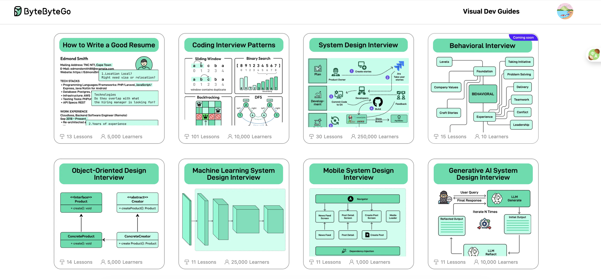

# ByteByteGo Course Export

Export and translate [ByteByteGo](https://bytebytego.com) Visual Dev Guides course content into Markdown format.

## Courses

The following courses are included:

1. How to Write a Good Resume
2. Coding Interview Patterns
3. System Design Interview
4. Object-Oriented Design Interview
5. Machine Learning System Design Interview
6. Mobile System Design Interview
7. Generative AI System Design Interview

## Scripts

- `translate-markdown-gemini.mjs` — Translate exported Markdown files using Google Gemini
- `translate-markdown-openai.mjs` — Translate exported Markdown files using OpenAI

## Free Ebook Offer

